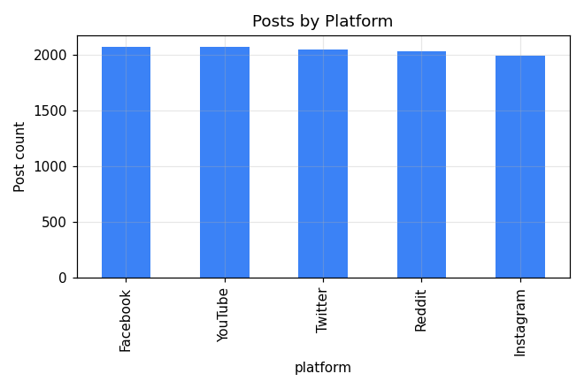
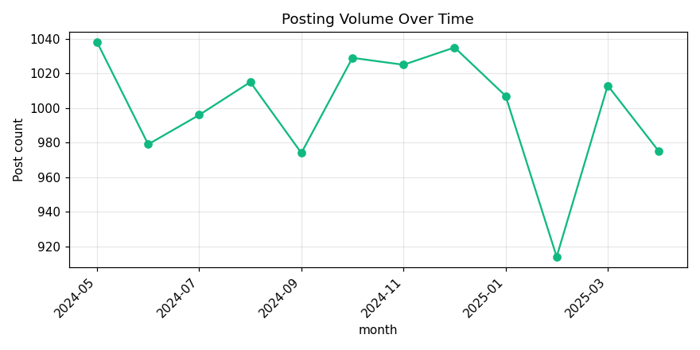
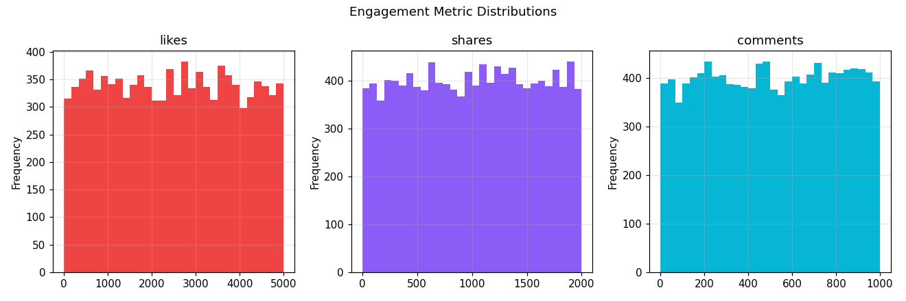
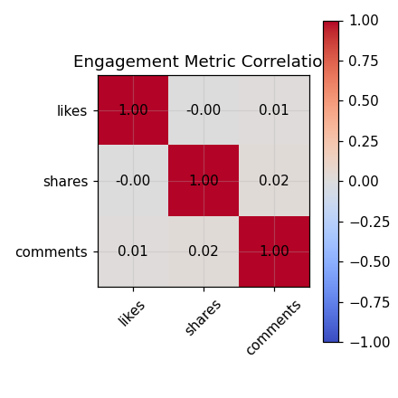
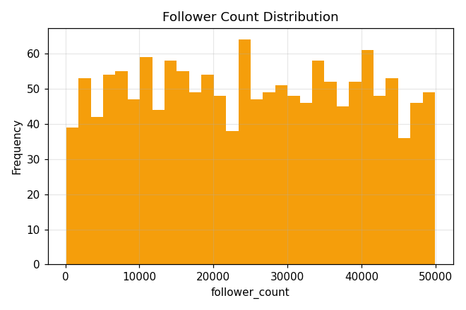
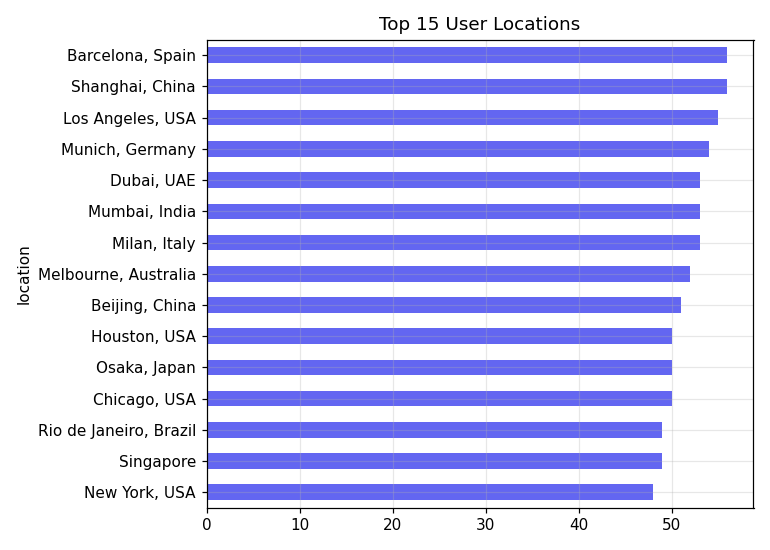
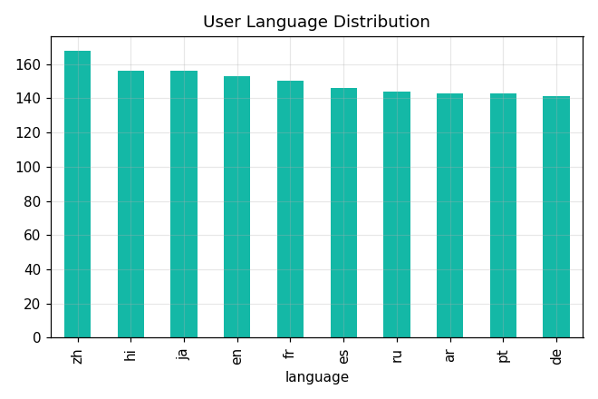
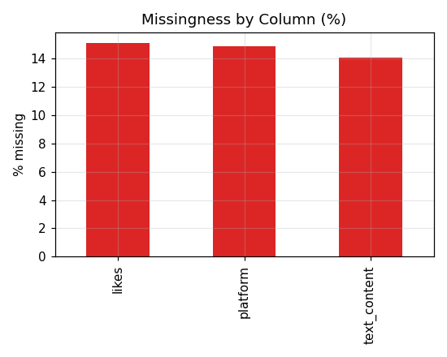
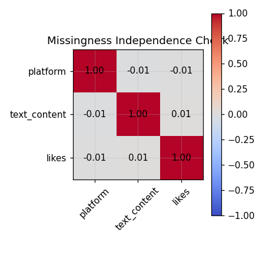

# Data Vortex — Round 1: EDA Report

**Dataset**: Social Engine (recovered from `node_07` — see Data Recovery section of the repo README)
**Files**: `Social_Engine_Users.csv` (1,500 rows), `Social_Engine_Posts_Corrupted.csv` (12,360 rows)

## 1. Data Recovery

The raw CSVs were not distributed as files — they were embedded as plain string constants
inside the recovery terminal's compiled JavaScript bundle. They were extracted directly from
that bundle and stored, unmodified, in `data/raw/`.

## 2. Data Quality Issues Found & Fixes Applied

`Users.csv` needed **no cleaning** — zero missing values, zero duplicate rows, zero duplicate
`user_id`s, no negative `follower_count` values, and every date parsed cleanly.

`Posts.csv` had five distinct issues:

| Issue | Rows affected | Fix applied | Reasoning |
|---|---|---|---|
| Exact duplicate rows | 360 | Dropped | Every field (including `post_id`) matched exactly — confirmed identical copies, not conflicting records to reconcile |
| `&amp;` entity in `text_content` | 328 | HTML-unescaped to `&` | `&amp;` was the *only* entity type present in the column — a standard decode, not content invention |
| Timestamps in 3 different formats (Unix epoch / ISO 8601 datetime / `DD-MM-YYYY` date-only) | all 12,000 (post-dedup) | Parsed into one consistent `timestamp_parsed` datetime column; date-only rows flagged with `timestamp_time_estimated=True` | Keeps precision honest — a `DD-MM-YYYY` row genuinely doesn't carry a time-of-day, so it isn't presented as equally precise to the other two formats |
| Negative `likes` values | 509 | Converted to absolute value | The magnitudes matched the valid (positive) `likes` distribution almost exactly, consistent with a sign-flip corruption rather than genuinely different data |
| Missing `platform`, `text_content`, `likes` (~15% each) | 1,784 / 1,688 / 1,814 | Left as `NULL` | See §5 — missingness was verified statistically independent across the three columns, so there's no correlated pattern to explain, and no defensible basis to guess a value |

A referential-integrity check confirmed every `user_id` in `Posts.csv` exists in `Users.csv` —
zero orphan rows.

Full, reproducible logic for every fix lives in `scripts/clean.py`, and the exact counts are
written to `data/processed/cleaning_summary.json` on every run.

## 3. Platform Distribution

Post volume is almost perfectly even across the five platforms (YouTube, Facebook, Twitter,
Reddit, Instagram each land in the ~2,000–2,140 range on the *raw* counts) — the
coefficient of variation across platform counts is under 2%. There is no dominant platform.

## 4. Posting Volume Over Time

Monthly post counts show no clear seasonal trend or growth/decline pattern — volume
fluctuates within a narrow band across the observed period rather than trending in either
direction.

## 5. Engagement Metrics: Likes, Shares, Comments

All three engagement metrics are **uniformly distributed** over their respective ranges
(`likes`: 0–5,000, `shares`: 0–2,000, `comments`: 0–1,000), each with a mean roughly equal to
half its max and no long tail. Real organic engagement data is almost always long-tailed
(most posts get little engagement, a few go viral) — a flat/uniform shape is the signature
of independently randomly generated values rather than genuine user behavior.

The pairwise correlation between `likes`, `shares`, and `comments` is effectively zero
(all |r| < 0.02). In real engagement data these three normally move together (a post that
gets a lot of likes also tends to get more shares and comments). Their near-total
independence here reinforces that these fields were generated independently at random
rather than reflecting organic post performance.

## 6. Follower Counts

`follower_count` is likewise close to uniform across its range (109–49,944), with mean and
median almost equal (~24,964 vs ~24,742). There's no "mega-influencer" long tail — a real
social platform's follower distribution is typically extremely skewed (most accounts have
few followers, a small number have huge followings). Its absence here is consistent with
synthetic/randomly generated data.

## 7. User Locations & Languages

Aggregating city-level `location` values up to country level: **USA is the single largest
user location** (203 users), followed by China (107), Germany (97), Italy (96), Japan (94),
and a long spread across roughly a dozen more countries — Brazil, India, Spain, UK, Canada,
France, Australia, UAE, Singapore, South Africa, Mexico, Egypt, South Korea, and Nigeria.
No single non-US country comes close to USA's share, but the "rest of world" is broadly and
fairly evenly spread rather than concentrated in one or two other countries.

Language usage across the 6 languages present (`en`, `fr`, `de`, `zh`, `ja`, `hi`, `ru` etc.)
is similarly broad with no single dominant language beyond a moderate lead.

## 8. Missingness Pattern

`platform`, `text_content`, and `likes` are each missing in roughly 14–15% of rows.

Checking whether these three columns tend to go missing *together* (which would suggest a
shared root cause, e.g. a batch of posts that failed to log entirely) shows pairwise
correlation between their missingness indicators is essentially zero (all |r| < 0.02, see
`reports/eda_summary.json` → `missingness_indicator_correlation`). The missingness is
statistically independent across the three fields — not a correlated block — which is why
each was left as `NULL` rather than imputed: there's no defensible signal to guess a value
from, and fabricating one would misrepresent the data.

## 9. Summary of Key Findings

- **Posts.csv shows signs of synthetic generation**: engagement metrics (`likes`, `shares`,
  `comments`) and `follower_count` are all uniformly distributed with near-zero pairwise
  correlation — the opposite of the long-tailed, correlated pattern real social-engagement
  data usually shows.
- **Platform and posting volume are both evenly distributed** — no dominant platform, no
  seasonal or growth trend.
- **USA is the single largest user location**; the remainder of users are spread broadly
  across ~15 other countries with no other single country dominating.
- **All corruption in Posts.csv was mechanical and reversible**: duplicate rows, one HTML
  entity type, three parseable timestamp formats, and a sign-flip on `likes` — none required
  guessing or fabricating data to fix.
- **Missing values in `platform`, `text_content`, and `likes` were left as `NULL`** because
  their missingness is independent across columns and carries no signal to impute from.

All numeric detail behind every chart is available in `reports/eda_summary.json`, generated
by `scripts/eda.py`.
